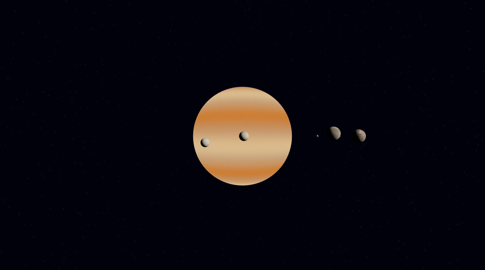

# Sistema Planetário - Projeto Prático 1
> _Cena 3D interativa com WebGL/Three.js_

  

---

## Instalação e execução (Vite + Node + Three.js)

> Requisitos: **Node.js (>= 20)** e **npm**

```bash
# 1) Verifique se a versão do node é superior à 20
node -v

# 2) Clone o repositório
git clone https://github.com/HenriqueBricoleri-Ufscar/PP1.git
cd PP1

# 3) Instale as dependências
npm init -y
npm install three
npm install --save-dev vite

# 4) Execute em modo desenvolvimento
npm run dev
```

Abra no navegador o endereço indicado no terminal (ex.: `http://localhost:5173`).

---

## Modo de interação
- **Troca de câmeras:** 
  *Pressione C para alternar entre câmera frontal e câmera Orbital.*

---

## Elementos do projeto
- Sistema planetário com vários corpos (Júpiter, Terra, Marte e luas)
- Texturas realistas aplicadas nos planetas e luas
- Movimento contínuo (rotação e órbitas)
- Shader customizado no planeta principal
- Fundo estrelado e iluminação da cena

---

## Como as especificações foram atendidas

**1) Pelo menos um objeto 3D por membro (com posição/escala próprias)**  
No projeto, cada integrante adicionou um corpo celeste independente, com **geometria, escala e posição únicas**:
- Júpiter (planeta principal)  
- Terra  
- Marte  
- Luas: Europa, Io, Calisto e Ganimedes  

**2) Shader próprio aplicado em um objeto**  
O planeta principal (Júpiter) utiliza **RawShaderMaterial**, com shader customizado para controlar a aparência e destacar o corpo central da cena.

**3) Pelo menos duas câmeras**  
Foram criadas **duas câmeras distintas**, e o usuário pode alternar entre elas em tempo real durante a execução.

**4) Movimento simples de pelo menos um objeto**  
As luas e planetas possuem **rotação própria** e algumas realizam **órbitas** ao redor de seus centros, garantindo movimento simples e visível.

**5) Aplicação de textura em pelo menos um objeto**  
Texturas reais foram aplicadas nos planetas/luas (ex.: Júpiter, Terra, Marte, Europa, Io, Calisto, Ganimedes), dando realismo à cena.

**6) Documentação no README**  
Este README descreve as **especificações atendidas**, **modo de interação** e **principais features** implementadas.

---

## Integrantes e contribuições

- **Henrique Bricoleri**
  - Setup inicial do projeto, render/scene/câmeras base
  - Light e conceito inicial do planeta principal (shader)
  - Textura de Júpiter e estrelas no fundo
  - Ajustes e correções finais

- **Jean Lucas**
  - Lua Europa com textura e órbita
  - Lua Io com textura vulcânica
  - Sistema de troca de câmeras

- **Fernando Aoki**
  - Lua Ganimedes (geometria, textura, rotação/órbita)
  - Marte adicionada com rotação
  - Ajustes de posição em luas (Calisto e Ganimedes)

- **Thiago Kraide**
  - Script e textura da Terra
  - Terra adicionada com rotação
  - Ajustes de posição/escala/rotação da Terra e Marte
  - Reposicionamento de câmeras
  - Lua Calisto com textura e órbita

---

## Vídeo de apresentação